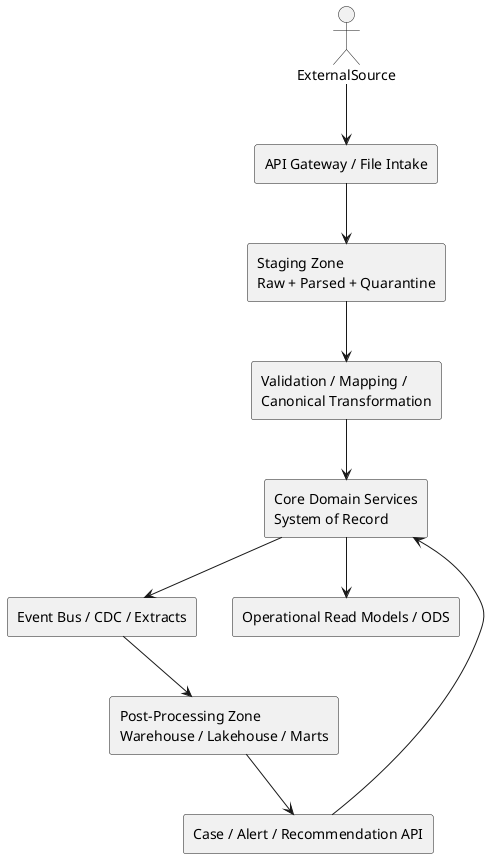

# Zone-Based Data Architecture for a National Health Insurance Platform

## Background

A national health insurance organization typically operates across multiple business domains and subsystems, such as membership, eligibility, providers, claims intake, claims adjudication, payments, fraud, customer service, employer contributions, benefits administration, and analytics. These domains ingest high volumes of submissions from many external and internal parties, often with uneven data quality, changing field definitions, evolving message versions, and different submission channels such as APIs, files, and partner integrations.

In this environment, a single undifferentiated operational database tends to fail for predictable reasons:

- inbound schemas change faster than operational systems can tolerate
- operational workloads and analytical workloads compete for the same resources
- source-specific payloads leak into business-critical data structures
- reprocessing becomes difficult when ingestion and transactions are tightly coupled
- auditability and lineage degrade when raw, canonical, and analytical data are mixed together

A zone-based data architecture addresses these problems by separating the platform into three primary data areas:

1. **Staging / Pre-Processing**
2. **Core / Transactions**
3. **Post-Processing / Analytics**

This document consolidates the architectural assessment of that approach, including where it is strong, where it can fail, how the zones should interact, and what guard rails are needed to make it workable at enterprise and national scale.

## Requirements

### Must Have

- Separate volatile ingestion concerns from stable operational transactions.
- Protect adjudication, review, and day-to-day processing from raw submission variability.
- Support high-volume intake from APIs, files, and partner systems.
- Preserve source payloads for audit, replay, reconciliation, and dispute handling.
- Maintain a governed canonical model for operational transactions.
- Support operational screens, case review, status tracking, adjudication, and regulated reporting from trusted data.
- Decouple analytics and reporting workloads from transactional performance.
- Provide end-to-end lineage across raw submission, transformed record, core transaction, and analytical output.
- Support reprocessing when mappings, validations, or source definitions change.
- Enforce strong data governance, security, privacy, and audit controls.

### Should Have

- Support both real-time and batch ingestion patterns.
- Support an API-first model for all public-facing interfaces while allowing more efficient internal pipelines behind those interfaces.
- Categorize APIs by business function, response semantics, and processing finality rather than by transport alone.
- Support domain-oriented ownership rather than a single monolithic enterprise schema.
- Allow controlled feedback from analytics into operational workflows as alerts, recommendations, or cases.
- Support schema versioning, mapping versioning, and business rule versioning.
- Provide a clear operating model for cross-zone data movement.
- Support read replicas or operational data stores for user-facing reporting that is close to live.

### Could Have

- Shared enterprise metadata services for schema registry, data contracts, and lineage.
- Lakehouse or warehouse patterns for downstream advanced analytics, data science, and actuarial analysis.
- Automated data quality scoring and confidence metrics at ingress.
- Domain event models for business milestones such as claim submitted, claim validated, claim adjudicated, payment issued, and exception raised.

### Won't Have for Initial Scope

- Direct ad hoc cross-zone writes between operational and analytical systems.
- Heavy analytical queries executed against core transactional tables as a primary reporting strategy.
- Source-specific payload structures persisted as first-class business entities in the core model.

## Method

### 1. Architectural Position

The proposed three-zone model is fundamentally sound for a national health insurance organization. It aligns three very different workload profiles:

- **Staging** handles high-change, high-volume, source-facing ingestion.
- **Core** handles stable, governed, auditable business transactions.
- **Post-Processing** handles read-heavy analytics, historical reconstruction, and consumption-oriented models.

The most important refinement is that these should be treated as **distinct data zones with explicit contracts**, not simply as three folders or schemas inside a single undifferentiated operational database.

The architecture succeeds when each zone has a clear purpose:

- **Staging accepts change.**
- **Core resists change.**
- **Post-Processing optimizes consumption.**

That phrase captures the central discipline of the model.

### 2. Zone Responsibilities

#### 2.1 Staging / Pre-Processing

Staging is the intake and conditioning zone. It exists to absorb variability without destabilizing the core business system.

Its responsibilities include:

- receiving payloads from APIs, file drops, and partner interfaces
- preserving the original submitted message or file
- parsing and decomposing source payloads
- validating structure and required fields
- mapping source-specific fields to canonical concepts
- checking reference codes and master data compatibility
- performing deduplication, idempotency checks, and enrichment
- routing invalid records to quarantine or exception handling
- supporting replay and reprocessing

Staging should be designed for flexibility, traceability, and throughput. It is the place where source systems are tolerated as they are.

However, staging must not become a permanent operational database. It is a controlled intake zone, not a shadow system of record.

#### 2.2 Core / Transactions

Core is the operational system of record for trusted business transactions. This is where review, adjudication, approvals, status transitions, financial obligations, and regulated business actions occur.

Its responsibilities include:

- maintaining canonical business entities
- enforcing referential and business integrity
- supporting review, adjudication, status tracking, and operational workflow
- preserving auditable transaction history
- applying benefit and policy rules in a controlled manner
- generating legally and operationally trusted outcomes

Core should be highly governed. Data arrives here only after passing controlled promotion from staging. Core is where the organization expresses its business truth, not where it negotiates raw partner variability.

This leads to a key guard rail: **staging accepts change; core resists change**. Core should not evolve every time a partner adds or renames a field. Instead, source-specific changes should be absorbed by staging mappings and promotion logic.

#### 2.3 Post-Processing / Analytics

Post-processing is the downstream consumption zone for reporting, dashboards, actuarial analysis, utilization management, fraud analytics, data science, policy analysis, and historical trend analysis.

Its responsibilities include:

- receiving curated data from core through controlled feeds
- storing historized and consumption-oriented models
- serving enterprise reports and analytical workloads
- supporting dimensional marts and denormalized read models
- enabling advanced analytics without harming transaction performance

This zone is optimized for reading, aggregating, and reconstructing history at scale. It should not be the place where live business transactions are authored.

### 3. The Missing Middle: Canonical Transformation

A critical refinement is the explicit transformation step between staging and core.

The real flow is not merely:

**Inbound -> Staging -> Core -> Analytics**

It is better understood as:

**Inbound payload -> Raw staging -> Validated/canonical staging -> Core transaction -> Analytical consumption**

This transformation layer is where the enterprise controls:

- schema version handling
- source-to-canonical mapping
- code translation
- data normalization
- business validation
- deduplication and idempotency
- lineage capture
- transformation versioning

Without this middle discipline, staging becomes a parking lot and core becomes contaminated by source-specific structures.

### 4. API-First Context and Interaction Model

The future-state architecture should be **API-first for all public-facing interfaces**. That means external systems, partner institutions, providers, employers, agencies, and authorized digital channels should interact through well-defined, versioned, documented APIs rather than through direct database integration or informal transport contracts.

At the same time, API-first at the edge does **not** require API-only inside the platform. Internally, the architecture should be free to use more efficient patterns such as:

- queues and event streams
- orchestration workflows
- CDC pipelines
- bulk ETL or ELT pipelines
- batch file ingestion where appropriate
- internal service-to-service protocols optimized for throughput and resiliency

This distinction is important. Public APIs are contracts for external consumers. Internal pipelines are implementation mechanisms for enterprise processing. Those two concerns should be deliberately separated so that public contracts remain stable while internal execution can evolve for efficiency, scale, and resilience.

A useful principle is:

- **External experience should be API-first.**
- **Internal execution should be workload-first.**

In practice, this means public APIs should usually terminate at the ingress and staging boundary, not directly against core tables or analytical stores.

### 5. Categorizing APIs by Function and Response Semantics

It is a good idea to categorize APIs not just by domain, but also by what kind of response they are expected to provide. For a national health insurance platform, response behavior has major architectural implications because some business interactions only need proof of receipt, while others require immediate business detail, tracking, or eventual outcome notification.

The first two categories identified are correct and foundational:

#### 5.1 Acknowledge-Acceptance APIs

These APIs mainly need to confirm that a submission was received and accepted into the platform for further processing. They do not promise that the business transaction has been completed or approved.

Typical examples:

- claim submission accepted for processing
- enrollment update accepted into intake
- provider roster accepted for validation
- batch manifest accepted

These APIs are especially appropriate when:

- payloads are large
- downstream processing is long-running
- business validation requires multiple systems
- final disposition is not immediately knowable
- reliability and throughput matter more than immediate detail

These APIs should typically return:

- receipt or correlation identifier
- submission timestamp
- intake status such as accepted, rejected, or accepted-with-warnings
- tracking link or status endpoint reference
- envelope-level validation errors if any

A critical design point is that "accepted" means accepted into controlled processing, not business approval.

#### 5.2 Detailed Synchronous Response APIs

These APIs return a detailed response immediately in the request-response cycle.

Typical examples:

- eligibility inquiry
- benefit coverage lookup
- provider lookup
- claim status inquiry
- document metadata query
- tariff or code validation lookup

These APIs are appropriate when:

- the answer can be computed quickly
- the consumer needs immediate detail to continue a workflow
- the result is a read or a lightweight validation
- the response is authoritative enough at that point in time

These APIs should return structured business detail and should clearly state whether the response is:

- informational
- preliminary
- final
- cached or near-real-time

However, there are additional important categories beyond those two.

#### 5.3 Immediate Validation Response APIs

These APIs do more than acknowledge receipt but less than provide a final business decision. They return immediate validation findings such as missing fields, schema issues, code mismatches, or policy-level pre-checks.

Typical examples:

- pre-adjudication validation
- enrollment payload validation
- code and format validation before final submission

This category is valuable because it reduces unnecessary staging churn and improves data quality at the edge without pretending to perform full business completion in real time.

#### 5.4 Asynchronous Request-Reply APIs

These APIs accept a request quickly, then complete processing later. The consumer receives a tracking identifier and later polls or follows a status resource.

Typical examples:

- claim submission requiring multi-step adjudication
- payment run initiation
- large reconciliation request
- cross-agency eligibility refresh

This category is often the best fit when the external interface is API-based but the internal work is pipeline-based. It gives a clean public contract while preserving internal freedom to process asynchronously.

These APIs should define:

- receipt ID and business correlation ID
- status endpoint
- lifecycle states such as received, validating, processing, completed, failed, partially completed
- retry and idempotency behavior
- completion artifact location where applicable

#### 5.5 Callback or Webhook APIs

Some interactions should notify the consumer when processing completes rather than forcing constant polling.

Typical examples:

- notify when a batch is fully processed
- notify when claim adjudication result is ready
- notify when reconciliation file is available

This is useful where partners can host callback endpoints and where event-driven notification improves timeliness and reduces repeated status checks.

Webhook-style patterns should be optional and carefully secured because not all public-sector or partner environments are equally capable of exposing reliable callback endpoints.

#### 5.6 Bulk or Batch Submission APIs

Some partners will need to submit large numbers of records in one interaction or one logical job. Even in an API-first architecture, bulk submission remains a valid category.

Typical examples:

- bulk claims submission
- employer contribution uploads
- provider network updates
- historical corrections or backloads

These APIs may return only job acceptance immediately, with detailed per-record results made available later through status resources, downloadable result files, or callbacks.

#### 5.7 Retrieval and Query APIs

These are read-oriented APIs that retrieve current or historical data needed by users, systems, or partner channels.

Typical examples:

- claim status
- member coverage snapshot
- provider accreditation status
- payment history
- case review details

These APIs should generally read from core read models, operational data stores, or well-defined query services rather than directly from write-optimized transactional tables.

#### 5.8 Command APIs

These APIs express an intended business action rather than merely storing data.

Typical examples:

- submit claim for adjudication
- approve exception
- trigger payment release
- create fraud investigation case
- reopen review

Command APIs are important because they clarify operational intent and allow the platform to enforce business rules, authorization, and audit consistently.

#### 5.9 Event Subscription or Notification APIs

In some cases, external or internal consumers do not need to call repeatedly. They need to subscribe to specific business events.

Typical examples:

- claim adjudicated
- member eligibility changed
- provider status suspended
- payment released

These can be delivered through webhooks, event gateways, message brokers, or integration platforms depending on the audience. This category is especially useful for decoupled inter-agency or partner integration.

### 6. Decision Dimensions for API Categorization

The right API category should be chosen based on business behavior, not developer preference alone. Key decision dimensions include:

- **Latency tolerance:** Does the consumer need an answer now, or is later acceptable?
- **Finality:** Is the answer final, preliminary, or only a receipt?
- **Payload size:** Is the interaction record-level or bulk?
- **Processing complexity:** Does it require long-running cross-system work?
- **User experience dependency:** Is a human waiting on the response to continue a workflow?
- **Consumer capability:** Can the consumer poll, host callbacks, or consume events?
- **Regulatory traceability:** Does the interaction need a formal receipt and lifecycle audit?
- **Idempotency and retry needs:** Can the same request be safely retried?
- **Ordering sensitivity:** Must records be handled in strict sequence?
- **Error granularity:** Are envelope-level, record-level, and business-level errors needed separately?

These dimensions matter more than whether the transport happens to be HTTP or something else.

### 7. Relationship of API Types to the Three Zones

The API taxonomy should align cleanly with the three-zone model.

#### Public APIs at the edge

Public-facing APIs should typically terminate at the ingress boundary and then hand work into staging or read models.

Typical mapping:

- submission and bulk intake APIs -> ingress -> staging
- query APIs -> core read models or ODS
- analytical export APIs -> curated post-processing endpoints where appropriate
- event notification APIs -> integration layer backed by core events or downstream publication

#### Internal processing behind the edge

Once a public API has accepted a request, the platform may continue processing through internal mechanisms such as:

- queue-driven validation
- workflow orchestration
- canonical mapping services
- CDC-driven publication
- batch enrichment or reconciliation

This prevents the public API surface from inheriting the complexity of internal execution.

### 8. API Guard Rails

The API-first posture needs its own guard rails.

#### Guard Rail 1: Do not expose core database structure through public APIs

Public APIs should expose stable business contracts, not internal table design.

#### Guard Rail 2: Acceptance is not completion

Any API that only confirms receipt must state that clearly in semantics, documentation, and status codes.

#### Guard Rail 3: Separate envelope validation from business disposition

Consumers should know whether a request failed transport/schema checks, failed business validation, or was accepted for deeper processing.

#### Guard Rail 4: Use idempotency for submission APIs

Retries are inevitable. Submission APIs should support safe replay and duplicate suppression.

#### Guard Rail 5: Long-running work should not pretend to be synchronous

If the real completion path is lengthy or uncertain, use receipt and tracking patterns rather than blocking calls or timeouts.

#### Guard Rail 6: Status resources need formal lifecycle states

Accepted work should be traceable through defined states and timestamps.

#### Guard Rail 7: Bulk APIs need dual-level reporting

Return both job-level results and record-level or line-level result details where relevant.

#### Guard Rail 8: Query APIs should use read-optimized models

Operational queries should read from services or replicas designed for that purpose, not directly from write-heavy internals.

#### Guard Rail 9: Internal efficiency must not leak into public contracts

The organization may use pipelines, files, queues, or batch internally, but public API consumers should see a stable contract independent of those internal choices.

### 9. How the Zones Should Talk to Each Other

The zones should interact through **controlled data movement and explicit contracts**, not through casual direct table sharing.

#### 4.1 Staging to Core

This is the most tightly governed boundary.

Preferred mechanisms:

- validation and transformation services
- workflow-driven promotion jobs
- queues or event-driven processing for near-real-time flows
- scheduled ETL or batch pipelines for file-based submissions

The typical pattern is:

1. a source submits a payload
2. the raw payload lands in staging
3. validation and enrichment occur
4. a canonical record is produced
5. only approved records are promoted into core

Key rule: **Core should not pull arbitrary raw data from staging for live business decisions.**

Instead, staging or the transformation layer should emit a controlled handoff such as a validated record, promotion event, or application command.

#### 4.2 Core to Post-Processing

This boundary should generally be downstream, one-way, and append-friendly.

Preferred mechanisms:

- change data capture
- domain events for business milestones
- scheduled extracts and snapshot pipelines
- replicated read models or warehouse loads

Key rule: **analytics should not be built by running heavy enterprise queries against the transactional core.**

Core should publish changes; post-processing should consume, reshape, historize, and serve them.

#### 4.3 Post-Processing to Core

This should be rare and tightly governed.

Analytics may produce insights such as fraud suspicion, utilization anomalies, or claim review recommendations. Those outputs should return to the operational world as:

- alerts
- tasks
- cases
- recommendations
- risk scores attached through approved service interfaces

Key rule: **post-processing must not write directly into core transactional tables.**

Feedback must re-enter core through the same business discipline as any other operational action.

### 10. Logical and Physical Separation

The three zones should be separate both logically and operationally. The degree of physical separation may vary, but the architecture should assume independent controls, workloads, and lifecycle management.

Options range from:

- separate schemas on a managed platform
- separate databases on one cluster
- separate clusters or services
- mixed technologies by workload, such as relational core plus warehouse or lakehouse analytics

At national scale, strong separation is usually beneficial because it allows distinct tuning, backup strategies, security policies, retention rules, performance isolation, and deployment cadences.

The anti-pattern is to create one giant database and declare three conceptual areas while still allowing uncontrolled joins, writes, and shared mutable tables across them.

### 11. Domain Ownership Considerations

The harder problem is often not the three-zone pattern itself but how it intersects with multiple business domains.

A health insurance enterprise commonly includes domains such as:

- member and beneficiary management
- provider registry and contracting
- eligibility and enrollment
- claims intake
- adjudication
- payments and remittances
- contributions and collections
- fraud and special investigation
- customer service and appeals
- reporting and policy analysis

The recommended posture is usually **domain-oriented ownership with a repeated zone pattern**, not a single monolithic enterprise core.

That means each major domain may have its own operational data ownership while still participating in the same zone-based governance model. This avoids a single massive core schema becoming a bottleneck, ownership confusion, or a change-management nightmare.

### 12. Reporting Strategy

Not all reporting belongs in the same place.

#### Operational reporting

Examples:

- pending claims by status
- adjudicator work queues
- current exceptions awaiting review
- payment batch readiness

These can be served from core, a read replica, or an operational data store close to core.

#### Analytical reporting

Examples:

- utilization trends over time
- regional cost comparisons
- provider behavior analysis
- fraud indicators across multiple periods
- actuarial forecasting and reserve analysis

These belong in post-processing.

A common error is to let the phrase "reports" justify broad analytical access into the core. That creates contention and weakens transactional stability.

### 13. Guard Rails

The following guard rails are essential.

#### Guard Rail 1: Staging absorbs volatility

Source-specific formats, changing data elements, evolving versions, and partial payload quality belong in staging and the transformation layer.

#### Guard Rail 2: Core remains canonical

Core stores validated business entities and transactions. It should not model every source quirk or every transient input structure.

#### Guard Rail 3: Post-processing is downstream by default

Analytics consumes curated outputs. It should not become a second operational write path.

#### Guard Rail 4: No direct cross-zone writes

Cross-zone writes should happen through services, events, CDC pipelines, or governed ETL. Casual direct writes blur ownership and undermine controls.

#### Guard Rail 5: Every movement is traceable

For every record handoff, preserve:

- source system identifier
- source record identifier
- ingestion timestamp
- transformation version
- rule set version
- load batch or event identifier
- operator or system origin

#### Guard Rail 6: Replay is a first-class capability

Because mappings, validations, and source definitions change frequently, the organization must be able to replay staging records through updated logic.

#### Guard Rail 7: Analytics cannot silently repair operations

If analytical systems discover issues or suspicious patterns, they must raise governed actions, not directly mutate operational truth.

#### Guard Rail 8: Keep source contracts and canonical contracts distinct

External contracts change according to partner needs; internal canonical contracts change only through disciplined business design.

### 14. Master and Reference Data

The simple three-zone picture is not enough by itself. A national health insurance platform also depends on governed reference and master data that cut across zones.

Examples include:

- provider master
- member master and golden identity
- benefit plans
- covered services
- diagnosis and procedure code sets
- facility registry
- geographic and administrative hierarchies
- payment schedules and tariffs

These data sets influence validation in staging, decisioning in core, and analytics in post-processing. They should therefore be treated as shared governed assets with clear publication and versioning rules.

### 15. Security, Privacy, and Audit

Because this is a national health insurance context, the architecture must assume strict privacy, access, and audit requirements.

The zone model helps because different data purposes can have different controls:

- staging may need strong quarantine and payload-level access control
- core requires fine-grained transactional access, immutable audit trails, and strong authorization
- post-processing may require de-identification, masking, row-level security, and broader consumption patterns

Auditability must cover not just who viewed or changed operational data, but also how a submitted payload became a core record and later an analytical data point.

### 16. Failure Modes and Anti-Patterns

The approach is strong, but it fails when misapplied.

Common anti-patterns include:

- using staging as a permanent operational store
- allowing core to read raw staging directly during adjudication
- letting source-specific payloads shape core tables
- building enterprise analytics through direct heavy querying of core
- allowing analytics teams to write back into core tables directly
- defining three zones conceptually while still operating one uncontrolled shared database
- skipping transformation versioning and therefore losing replay integrity
- using a single monolithic enterprise core where domains actually need separate ownership

### 17. High-Level Architecture

This diagram emphasizes the preferred directional flow while preserving a controlled analytical feedback path.

### 18. Data Flow Summary

The intended enterprise pattern is:

- **Staging -> Core -> Post-Processing** as the primary directional flow
- asynchronous, contract-based handoffs wherever practical
- read/write discipline enforced by zone ownership
- explicit transformation between source reality and business truth

This pattern gives the organization flexibility at the edges and stability at the center.

## Implementation

### Phase 1: Define the operating model

- define domain boundaries and ownership
- decide whether each domain gets its own core database or service-owned persistence
- define what qualifies as staging, core, and post-processing for each major domain
- document the allowed integration mechanisms between zones

### Phase 2: Design the data contracts and API taxonomy

- define public API categories by business function and response semantics
- separate receipt APIs, synchronous detail APIs, async request-reply APIs, bulk APIs, callback APIs, and query APIs
- define which APIs terminate in staging, which read from core read models, and which expose curated downstream data
- standardize correlation IDs, receipt IDs, idempotency keys, status resources, and lifecycle states
- document public APIs with a formal API description standard

### Phase 3: Design the data contracts

- define source contracts for inbound submissions
- define canonical contracts for core promotion
- define downstream contracts for analytical consumption
- define versioning rules for all three

### Phase 4: Build staging properly

- implement raw payload capture
- implement parsed payload structures
- implement validation, quarantine, replay, and reconciliation
- implement idempotency and deduplication rules

### Phase 5: Harden the core

- define canonical entities and transactional flows
- implement audit trails, status transitions, and integrity rules
- separate operational read models from write models where useful
- prohibit source-specific schema drift into core

### Phase 6: Establish downstream publication

- implement CDC, events, or extracts from core
- load post-processing stores with historized models
- create analytical marts and dashboards in the downstream zone
- keep heavy queries off the transactional path

### Phase 7: Implement governed feedback

- define which analytical findings can become operational alerts or cases
- expose service APIs for those feedback actions
- prohibit direct table-level writeback from analytics

### Phase 8: Strengthen governance

- implement metadata, lineage, schema versioning, and transformation registry
- implement role-based and attribute-based access controls as needed
- define retention, archival, de-identification, and audit policies by zone

## Milestones

1. **Architecture Baseline Approved**
   - three-zone model approved
   - domain ownership model approved
   - public API-first policy approved
   - cross-zone interaction rules approved
2. **API Taxonomy and Edge Contracts Approved**
   - public APIs categorized by response semantics and function
   - receipt, synchronous, asynchronous, bulk, callback, and query patterns standardized
   - correlation, idempotency, and status lifecycle conventions approved
3. **Staging Capability Operational**
   - raw capture, validation, quarantine, and replay implemented for initial submission channels
4. **Core Canonical Model Operational**
   - first domain transactions executed only through controlled promotion from staging
5. **Post-Processing Pipeline Operational**
   - core-to-analytics publication in place
   - analytical marts and dashboards separated from transactional systems
6. **Governed Feedback Loop Operational**
   - analytical alerts or cases can re-enter core through approved service interfaces
7. **Enterprise Governance Matured**
   - lineage, metadata, versioning, access controls, and audit policies institutionalized
   - three-zone model approved
   - domain ownership model approved
   - cross-zone interaction rules approved

## Gathering Results

The approach is working if the following outcomes can be observed:

- ingestion changes no longer force rapid redesign of transactional schemas
- operational performance remains stable despite increased analytical demand
- source payloads can be replayed when rules or mappings change
- adjudication and review operate on trusted canonical data
- analytical teams no longer depend on direct heavy access to the core system
- downstream reports can reconstruct history with confidence
- every key output can be traced back to its source submission and transformation path
- domains can evolve independently without collapsing into one enterprise database bottleneck

The architecture is failing or drifting if the following signs appear:

- Staging tables become a hidden operational store
- The core begins accumulating source-specific columns and exceptions
- Analysts repeatedly demand direct SQL access to the core for business-critical reporting
- Reprocessing becomes manual or impossible
- Ownership of data between domains and zones becomes unclear
- Operational and analytical release cycles begin to conflict

## Conclusion

The proposed three-zone architecture is an appropriate and mature direction for a national health insurance enterprise, especially where submission frequency is high and input definitions change often. Its main strength is that it allows the organization to absorb change at the edges, protect business truth at the center, and enable scalable consumption downstream.

The architecture should not be understood as a simple physical database partitioning exercise. It is a governance and operating model as much as a technical pattern. Its success depends on disciplined boundaries, contract-based handoffs, explicit transformation, domain ownership, replayability, and auditability.

The core ideas are simple and worth preserving:- **Staging accepts change.**

- **Core resists change.**
- **Post-Processing serves consumption.**
- **Public APIs present stable contracts.**
- **Internal pipelines optimize execution.****
- **Public APIs present stable contracts.**
- **Internal pipelines optimize execution.**

If those principles are enforced with the guard rails described above, this approach is well suited to the enterprise architecture of a national health insurance organization.